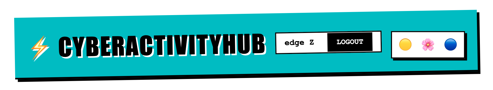
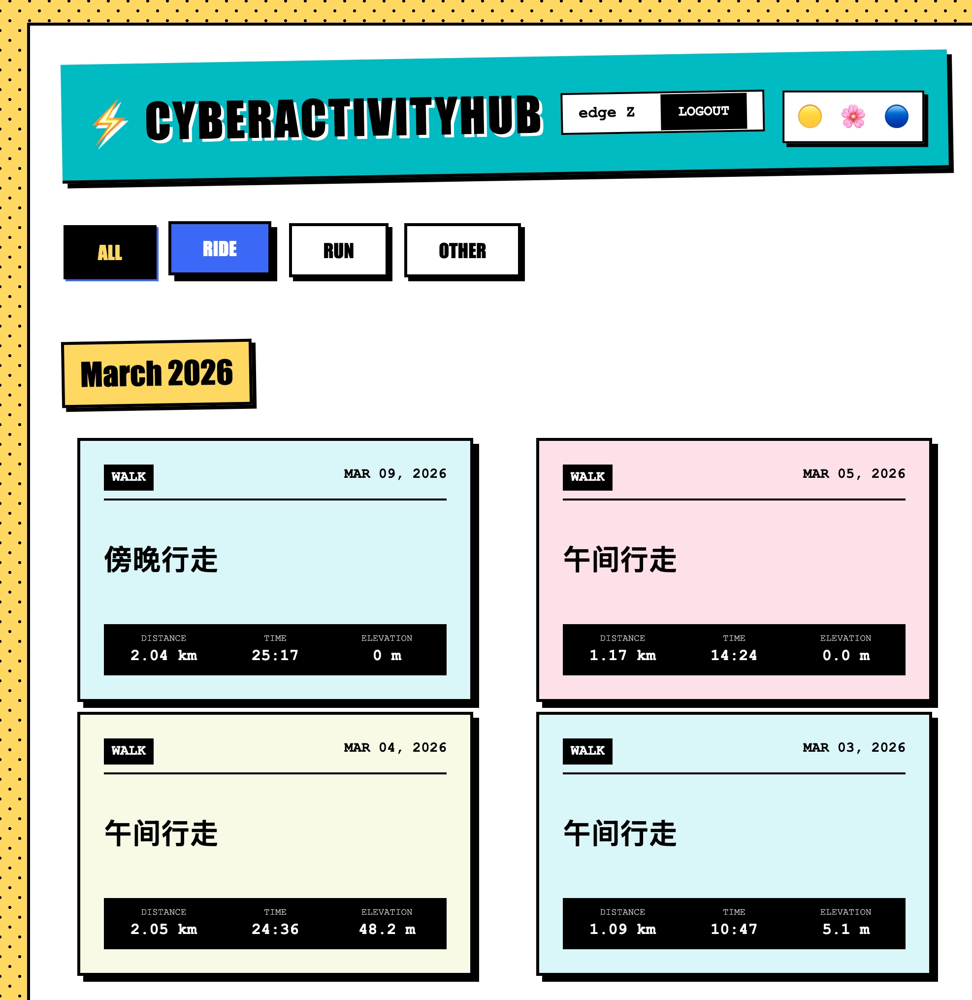
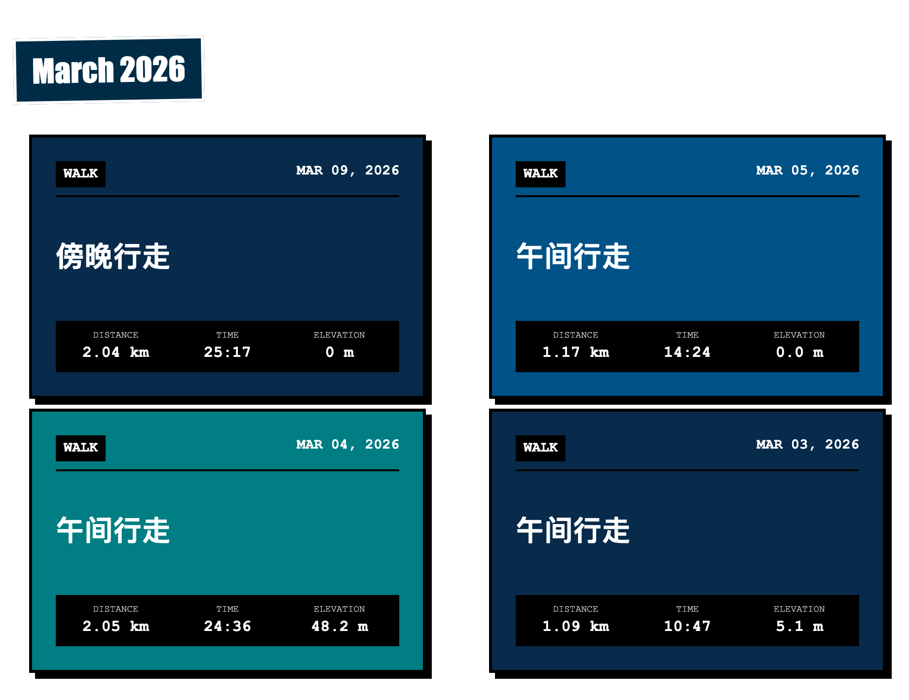

# ⚡️ CYBER ACTIVITY HUB ⚡️



## 💥 THE ULTIMATE MAXIMALIST STRAVA DASHBOARD 💥

> **WARNING: EXTREME VISUALS INSIDE** ⚠️
> **警告：极繁主义高能预警** ⚠️

---

### 🧬 WHAT IS THIS? (这是什么鬼？)
This is not your average, boring, minimalist fitness tracker. This is **CyberActivityHub**.
It rips your Strava data from the cloud and SMASHES it onto your screen in a glorious explosion of **YELLOW**, **PINK**, and **BLUE**.

这是一个**拒绝无聊**、**拒绝极简**的健身追踪器。
它把你的 Strava 数据从云端拽下来，然后用**高饱和度**的色彩狠狠地砸向你的屏幕！

---

### 🚀 FEATURES (爆炸功能)

*   **NEO-BRUTALISM UI (新粗野主义界面)**
    *   Thick borders. Hard shadows. No apologies.
    *   粗边框。硬阴影。绝不道歉。

*   **BENTO GRID LAYOUT (便当盒布局)**
    *   Your stats and maps, perfectly interlocked like a futuristic puzzle.
    *   数据与地图，像未来主义拼图一样完美咬合。

*   **MULTI-THEME ENGINE (多主题引擎)**
    *   🟡 **DEFAULT**: High-voltage Yellow (高压黄)
    *   🌸 **PINK**: Vaporwave Aesthetic (蒸汽波粉)
    *   🔵 **BLUE**: Deep Dive Prussian (普鲁士蓝)

*   **INTERACTIVE MAPS (交互地图)**
    *   Powered by Leaflet. See where you conquered.
    *   基于 Leaflet。看看你征服了哪里。

*   **MONTHLY ARCHIVES (月度归档)**
    *   Organized chaos. Sorted by time.
    *   有序的混乱。按时间切片。

---

### 🛠️ TECH STACK (技术栈)
*   🐍 **Python & Flask**: The engine (引擎).
*   🗺️ **Leaflet.js**: The cartography (制图).
*   🎨 **CSS Variables**: The paint (颜料).
*   🔥 **Pure Chaos**: The vibe (氛围).

---

### 🔌 HOW TO IGNITE (如何点火)

1.  **CLONE IT (克隆代码)**
    ```bash
    git clone this repo
    cd cyber-activity-hub
    ```

2.  **ENV IT (配置环境)**
    Create a `.env` file and punch in your Strava API keys:
    (创建 `.env` 文件并填入你的 Strava API 密钥：)
    ```env
    STRAVA_CLIENT_ID=your_id
    STRAVA_CLIENT_SECRET=your_secret
    SECRET_KEY=super_secret_key
    ```

3.  **INSTALL IT (安装依赖)**
    ```bash
    pip install -r requirements.txt
    ```

4.  **RUN IT (启动引擎)**
    ```bash
    python app.py
    ```

5.  **WITNESS IT (见证奇迹)**
    Open your browser and go to: `http://127.0.0.1:5000`

---

### 🎨 SCREENSHOTS (截图预览)





---

*BUILT FOR THE BOLD.*
*为大胆者构建。*
